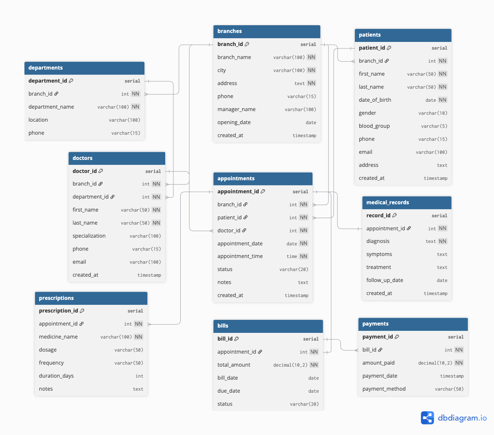

# Hospital Management System

A production-grade multi-branch hospital database built with
PostgreSQL, demonstrating real-world Database Administrator
(DBA) skills including schema design, stored procedures,
indexing, role-based security, and automated backup/recovery.

## 📌 Project Overview

This project simulates a real hospital database system for
a multi-branch hospital network . The database manages patients,
doctors, appointments, medical records, prescriptions, billing,
and payments across all branches.

### Problem This Project Solves

| Problem | Solution |
|---|---|
| No centralized patient records | Unified patients table across all branches |
| Appointment double booking | Unique constraint on doctor + date + time |
| Prescription errors | Prescriptions linked directly to appointments |
| Billing confusion | Automatic bill generation via triggers |
| No data security | Role-based access control for 5 user types |
| No backup plan | Automated daily backup with pg_dump |

## Database Design

### ERD Diagram

| Table | Description |
|---|---|
| branches | Hospital branch locations |
| departments | Departments per branch |
| doctors | Doctors assigned to branches |
| patients | Registered patients |
| appointments | Patient visits |
| medical_records | Diagnosis per appointment |
| prescriptions | Medicines prescribed |
| bills | Bills per appointment |
| payments | Payments against bills |

### Relationships

| Relationship | Type |
|---|---|
| Branch → Departments | One to Many |
| Branch → Doctors | One to Many |
| Branch → Patients | One to Many |
| Branch → Appointments | One to Many |
| Department → Doctors | One to Many |
| Patient → Appointments | One to Many |
| Doctor → Appointments | One to Many |
| Appointment → Medical Record | One to One |
| Appointment → Prescriptions | One to Many |
| Appointment → Bill | One to One |
| Bill → Payments | One to Many |

### 1. Schema Design
- Fully normalized to 3NF
- 11 foreign key relationships
- CHECK constraints for data validation
- UNIQUE constraints preventing double booking

### 2. Stored Procedures
- register_patient — registers new patient with auto ID
- book_appointment — books appointment with double booking check
- complete_appointment — marks appointment complete and auto generates bill
- record_payment — records payment and auto updates bill status

### 3. Views
- patient_summary — full patient profile with visit count and age
- doctor_schedule — complete appointment schedule per doctor
- branch_revenue — revenue report across all branches
- unpaid_bills_report — all unpaid and overdue bills

### 5. Indexes (9 total)
- One index per table on most frequently searched column
- Reduces query time from Sequential Scan to Index Scan

### 6. Role Based Security (5 roles)

| Role | Access |
|---|---|
| receptionist_role | patients, appointments |
| doctor_role | medical records, prescriptions |
| billing_role | bills, payments |
| pharmacist_role | prescriptions only |
| admin_role | full access |

### 7. Backup & Recovery
- Full backup using pg_dump custom format
- Schema only and data only backups
- Recovery tested in separate database
- Automated daily backup script

## 📁 Project Structure
